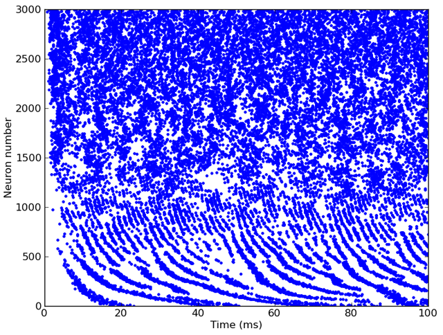

.. currentmodule:: brian2hears

Connecting with Brian
---------------------

To create spiking neuron models based on filter chains, you use the
:class:`FilterbankGroup` class. This acts exactly like a standard Brian
:class:`~brian2.NeuronGroup` except that you give a source filterbank and choose
a state variable in the target equations for the output of the filterbank.
A simple auditory nerve fibre model would take the inner hair cell model from
earlier, and feed it into a noisy leaky integrate-and-fire model as follows::

	# Inner hair cell model as before
	cfmin, cfmax, cfN = 20*Hz, 20*kHz, 3000
	cf = erbspace(cfmin, cfmax, cfN)
	sound = Sound.whitenoise(100*ms)
	gfb = Gammatone(sound, cf)
	ihc = FunctionFilterbank(gfb, lambda x: 3*clip(x, 0, Inf)**(1.0/3.0))
	# Leaky integrate-and-fire model with noise and refractoriness
	eqs = '''
	dv/dt = (I-v)/(1*ms)+0.2*xi*(2/(1*ms))**.5 : 1 (unless refractory)
	I : 1
	'''
	G = FilterbankGroup(ihc, 'I', eqs, reset='v=0', threshold='v>1', refractory=5*ms)
	# Run, and raster plot of the spikes
	M = SpikeMonitor(G)
	run(sound.duration)
	plot(M.t/ms, M.i, '.')
	show()

And here's the output:

