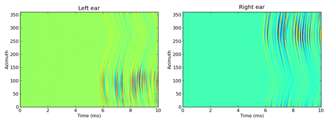

.. currentmodule:: brian2hears

.. index::
    single: HRTF
    pair: IRCAM; HRTF
    pair: database; HRTF

Head-related transfer functions
-------------------------------

You can work with head-related transfer functions (HRTFs) using the three
classes :class:`HRTF` (a single pair of left/right ear HRTFs),
:class:`HRTFSet` (a set of HRTFs, typically for a single individual), and
:class:`HRTFDatabase` (for working with databases of individuals). At the
moment, we have included only one HRTF database, the :class:`IRCAM_LISTEN`
public HRTF database. There is also one artificial HRTF database,
:class:`HeadlessDatabase` used for generating HRTFs of artifically introduced ITDs.

An example of loading the IRCAM database, selecting a subject and plotting
the pair of impulse responses for a particular direction::

    hrtfdb = IRCAM_LISTEN()
    hrtfset = hrtfdb.load_subject(1002)
    hrtf = hrtfset(azim=30, elev=15)
    plot(hrtf.left)
    plot(hrtf.right)
    show()

:class:`HRTFSet` has a set of coordinates, which can be
accessed via the ``coordinates`` attribute, e.g.::

    print hrtfset.coordinates['azim']
    print hrtfset.coordinates['elev']

You can also generated filterbanks associated either to an :class:`HRTF` or
an entire :class:`HRTFSet`. Here is an example of doing this with the IRCAM
database, and applying this filterbank to some white noise and plotting the
response as an image::

    # Load database
    hrtfdb = IRCAM_LISTEN()
    hrtfset = hrtfdb.load_subject(1002)
    # Select only the horizontal plane
    hrtfset = hrtfset.subset(lambda elev: elev==0)
    # Set up a filterbank
    sound = whitenoise(10*ms)
    fb = hrtfset.filterbank(sound)
    # Extract the filtered response and plot
    img = fb.process().T
    img_left = img[:img.shape[0]/2, :]
    img_right = img[img.shape[0]/2:, :]
    subplot(121)
    imshow(img_left, origin='lower left', aspect='auto',
           extent=(0, sound.duration/ms, 0, 360))
    xlabel('Time (ms)')
    ylabel('Azimuth')
    title('Left ear')
    subplot(122)
    imshow(img_right, origin='lower left', aspect='auto',
           extent=(0, sound.duration/ms, 0, 360))
    xlabel('Time (ms)')
    ylabel('Azimuth')
    title('Right ear')
    show()

This generates the following output:

For more details, see the reference documentation for :class:`HRTF`,
:class:`HRTFSet`, :class:`HRTFDatabase`, :class:`IRCAM_LISTEN` and
:class:`HeadlessDatabase`.
