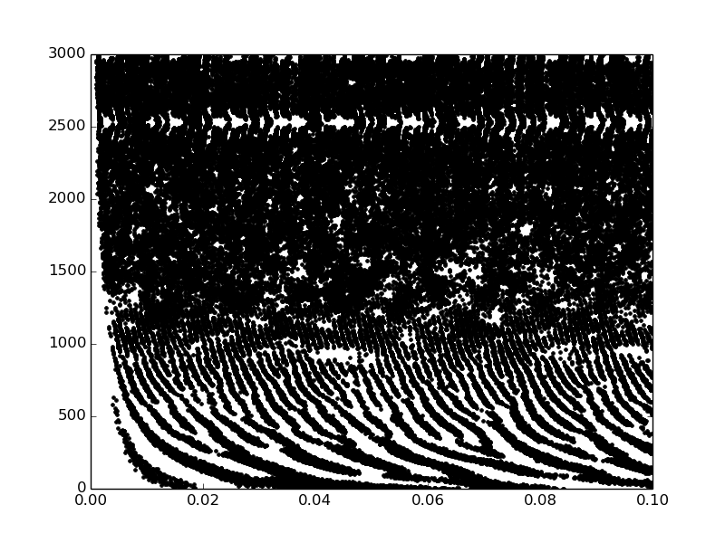

Introduction
============

This library provides the Brian 2 counterpart of the brian.hears module in Brian 1.x. 

Status
------

Only a very limited set of functions from the previous package are already ported, but it should be moving fast in the future. 
The most important object that has been implemented is the LinearFilterbankGroup, which provides a good starting point for simple auditory models and filtering. 

Notes
-----

Brian2hears filtering objects all are instances of Brian2 Groups, which means that they can be used in much the same way. It means that brian2hears will be kept compatible with the code generation mechanisms of brian2.

Much of the syntax of the previous module will be retained, despite being briantwoed as per necessary. 
