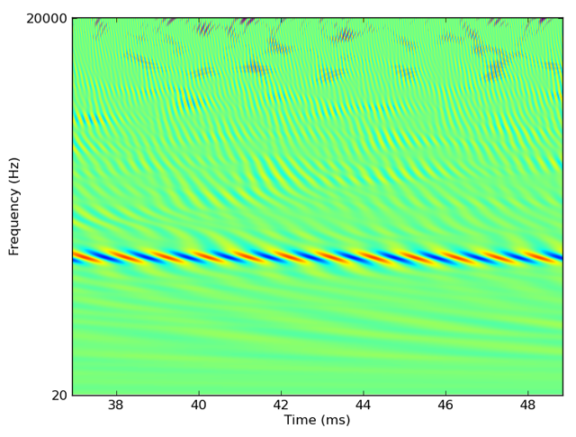
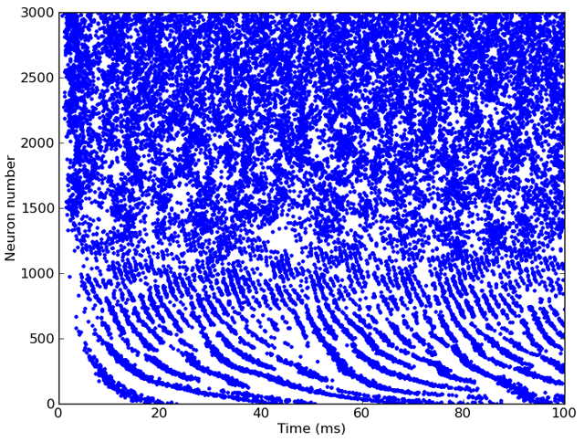

.. currentmodule:: brian2hears

Introduction
------------

Download and installation
~~~~~~~~~~~~~~~~~~~~~~~~~

To download Brian hears, TODO.

Getting started
~~~~~~~~~~~~~~~

Brian hears is primarily designed for generating and manipulating sounds, and applying
large banks of filters. We import the package by writing::

    from brian2 import *
    from brian2hears import *

Then, for example, to generate a tone or a whitenoise we would write::

    sound1 = tone(1*kHz, .1*second)
    sound2 = whitenoise(.1*second)

These sounds can then be manipulated in various ways, for example::

    sound = sound1+sound2
    sound = sound.ramp()

If you have the `pygame <http://www.pygame.org>`__ package installed, you can
also play these sounds::

    sound.play()

We can filter these sounds through a bank of 3000 gammatone filters covering
the human auditory range as follows::

    cf = erbspace(20*Hz, 20*kHz, 3000)
    fb = Gammatone(sound, cf)
    output = fb.process()

The output of this would look something like this (zoomed into one region):

Alternatively, if we're interested in modelling auditory nerve fibres, we could
feed the output of this filterbank directly into a group of neurons defined with
Brian::

    # Half-wave rectification and compression [x]^(1/3)
    ihc = FunctionFilterbank(fb, lambda x: 3*clip(x, 0, Inf)**(1.0/3.0))
    # Leaky integrate-and-fire model with noise and refractoriness
    eqs = '''
    dv/dt = (I-v)/(1*ms)+0.2*xi*(2/(1*ms))**.5 : 1 (unless refractory)
    I : 1
    '''
    anf = FilterbankGroup(ihc, 'I', eqs, reset='v=0', threshold='v>1', refractory=5*ms)

This model would give output something like this:

The human cochlea applies the equivalent of 3000 auditory
filters, which causes a technical problem for modellers which this package is
designed to address. At a typical sample rate, the output of 3000 filters would
saturate the computer's RAM in a few seconds. To deal with this, we use
online computation, that is we only ever keep in memory the output of the
filters for a relatively short duration (say, the most recent 20ms), do our
modelling with these values, and then discard them. Although this requires that
some models be rewritten for online rather than offline computation, it allows
us to easily handle models with very large numbers of channels. 3000 or 6000 for
human monaural or binaural processing is straightforward, and even much larger
banks of filters can be used (for example, around 30,000 in
`Goodman DFM, Brette R (2010). Spike-timing-based computation in sound localization. PLoS Comput. Biol. 6(11): e1000993. doi:10.1371/journal.pcbi.1000993 <http://www.ploscompbiol.org/article/info:doi/10.1371/journal.pcbi.1000993>`__).
Techniques for online computation are discussed below in the section
`Online computation`_.

Brian hears consists of classes and functions
for defining `sounds`_, `filter chains`_, cochlear models, neuron models and
`head-related transfer functions`_.
These classes
are designed to be modular and easily extendable. Typically, a model will
consist of a chain starting with a sound which is plugged into a chain of
filter banks, which are then plugged into a neuron model.

The two main classes in Brian hears are :class:`Sound` and :class:`Filterbank`,
which function very similarly. Each consists of multiple channels (typically
just 1 or 2 in the case of sounds, and many in the case of filterbanks,
but in principle any number of channels is possible for either). The difference
is that a filterbank has an input source, which can be either a sound or
another filterbank.

All scripts using Brian hears should start by importing the Brian and Brian
hears packages as follows::

    from brian2 import *
    from brian2hears import *

.. seealso::

    Reference documentation for :ref:`brian-hears-reference`, which
    covers everything in this overview in detail, and more. List of
    :ref:`examples of using Brian hears <examples-hears>`.

Update for Brian 2
~~~~~~~~~~~~~~~~~~

For users of Brian hears for Brian 1, note that the following no longer works in Python 2 (although
it will work in Python 3)::

    sound = whitenoise(100*ms)
    sound[:10*ms] # to get the first 10 ms of a sound

This is because of a change in the way units are handled between Brian 1 and Brian 2. To get the same
effect, you can write::

    sound = whitenoise(100*ms)
    sound[slice(0*ms, 10*ms)] # to get the first 10 ms of a sound

This will work in both Python 2 and 3.

For users of Brian 2, note that the following will not work with :class:`FilterbankGroup`:

* ``store()`` and ``restore()`` will not work unless you are calling ``store()`` at time t=0.
* The standalone mode of Brian 2 will not work.